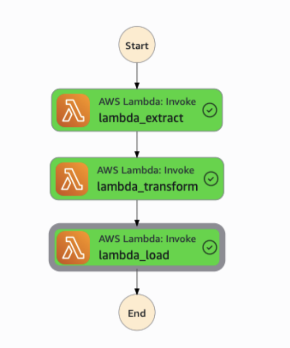

# Welcome to DE-Terrific-Totes-Team-8
## Team Trent's Northcoders project 
## June 2025
 
The project is an `ETL` task, hosted on Amazon Web Services (AWS) involving three lambda functions that perform:
• `Extraction` of 11 tables of sales data from an OTP database Totesys into an S3 ingestion bucket as JSON files.
• `Transformation` of 6 of the 11 original tables to create 7 related tables in a star schema format. These are saved in a separate S3 processed bucket as parquet files.
• `Loading` of data from the parquet files into an OLAP database Warehouse

After the initial extraction of data, the process is triggered every 20 minutes to collect latest updates to any of the original tables. If there are any new data, these saved into the Warehouse.

This project was written in <ins>Python</ins> using modules 
- pg8000 for database connections
- boto3 for AWS connections
- pandas and awswrangler to transform tables into dataframes and output files
- pytest for unit and integration testing
- moto for testing of functions using AWS clients and resources

<ins>Terraform</ins> was used to set up infrastructure on the AWS cloud.

<ins>SQL</ins> was used within or outside pg8000 to query and write to the databases.

Apart from the technical work, the team applied Agile methodology. A [Trello kanban board](https://trello.com/invite/b/68307bac1d02b090255089b9/ATTI1ea8b92d44b544cbfe6b8ab2b1593dd9B09F5955/terrific-totes-team-08-trent) was used to organise tasks. Twice daily scrums were held with a rotating scrum leader.

